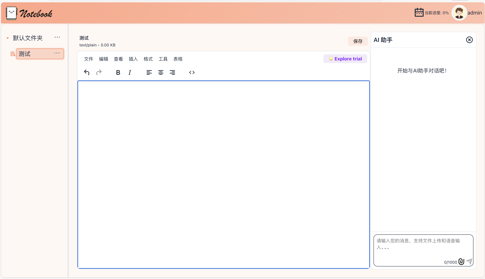
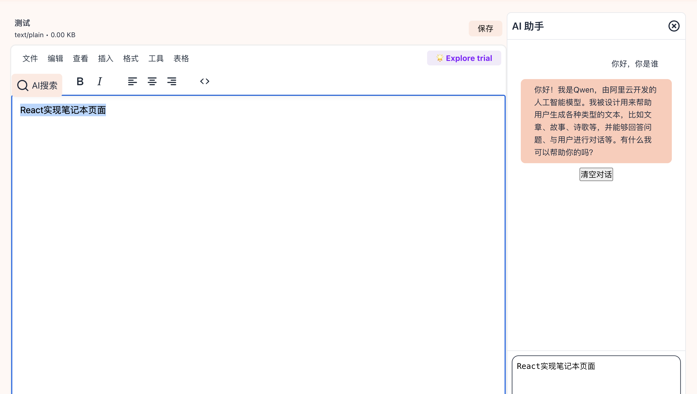
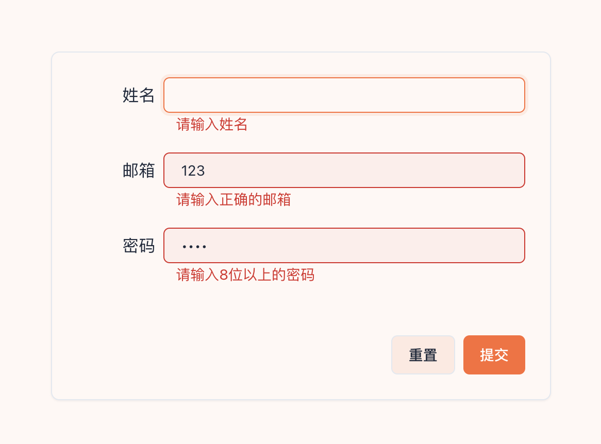
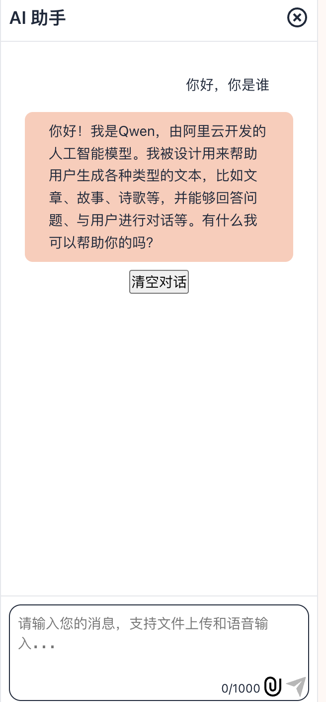
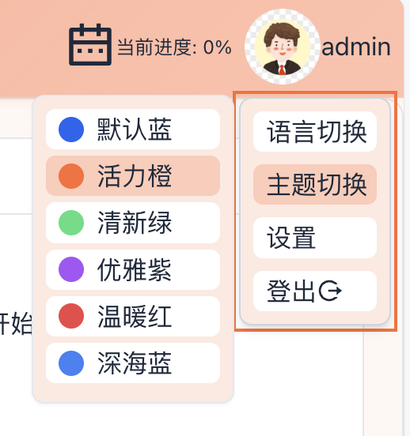
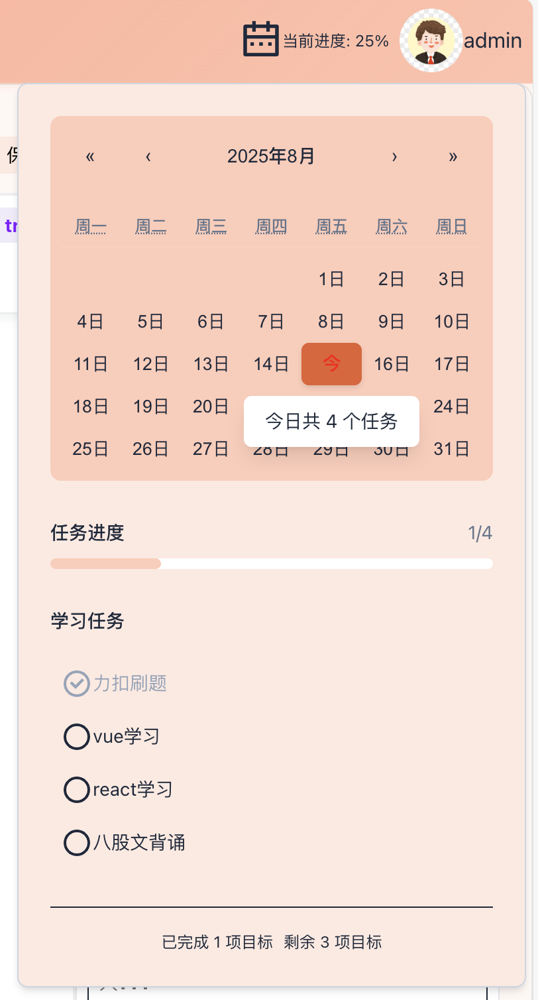
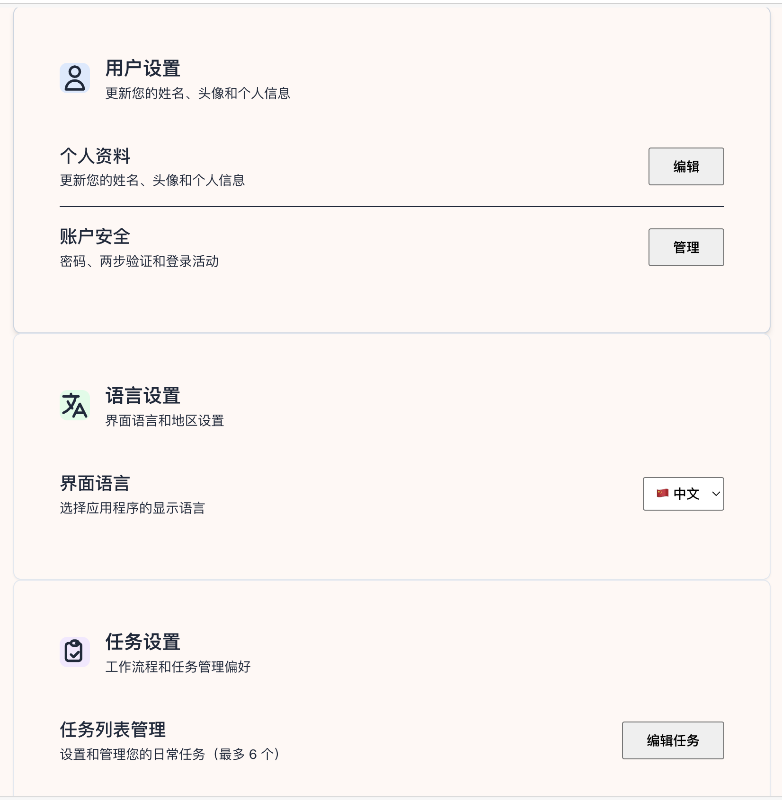

# notebook-react
笔记本网页

首页
- 支持新建、删除、重命名文件夹
- 支持新建、删除、重命名文件
- 支持文件内容编辑
- 支持文件内容AI搜索
- 支持主题切换
- 支持中英文切换
- 可查看学习任务

登录/注册
  - 支持双 token 无感登录
  - 表单格式校验

AI 问答
  - 支持流式输出
  - 支持中断输出
  - 支持图片文件上传

设置页
  - 支持切换主题
  - 支持中英文切换
  - 支持设置学习任务

## 页面预览

### 首页与搜索

  
  

### 登录/注册

  

### AI 问答

  

### 主题与时间轴

  
  

### 设置页

  

